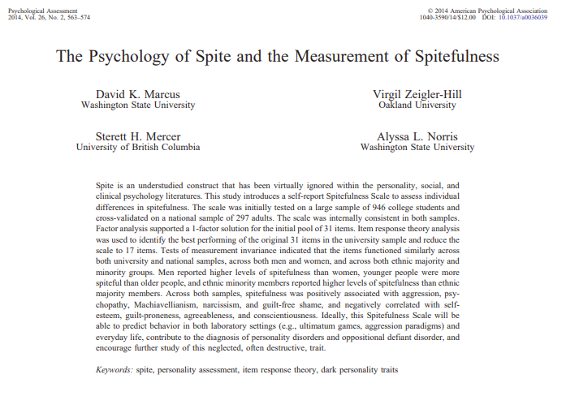
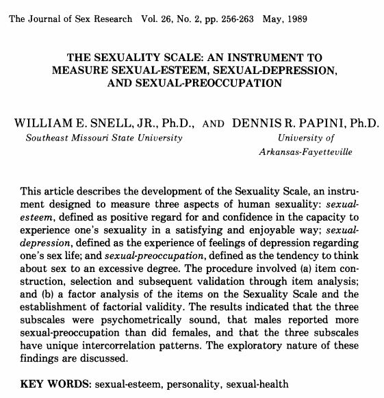
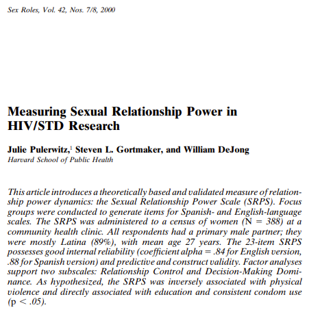
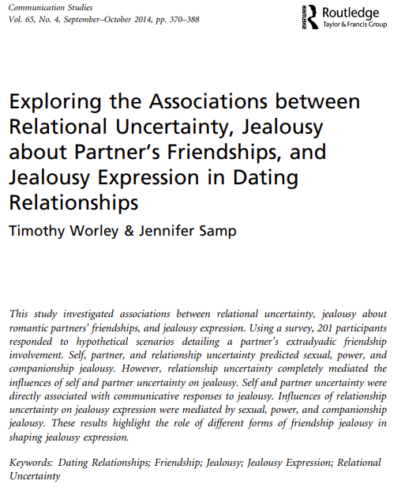

```{r xaringan-logo, echo=FALSE}

css_position <- function(
  top = "1em",
  right = "1em",
  left = NULL,
  bottom = NULL
) {
  p <- list()
  p$top <- if (!is.null(bottom) && missing(top)) NULL else top
  p$right <- if (!is.null(left) && missing(right)) NULL else right
  p$bottom <- if (!is.null(top) && missing(bottom)) NULL else bottom
  p$left <- if (!is.null(right) && missing(left)) NULL else left
  class(p) <- c("css_position", class(p))
  p
}

is_css_position <- function(x) {
  if (inherits(x, "css_position")) {
    return(TRUE)
  }
  x <- x[vapply(x, function(y) !is.null(y), logical(1))]
  has_vert <- length(setdiff(c("top", "bottom"), names(x))) <= 1
  has_horz <- length(setdiff(c("right", "left"), names(x))) <= 1
  has_vert && has_horz
} 

xaringanExtra::use_logo(
  image_url = "https://sn3302files.storage.live.com/y4m1C8R68FO1Cw-aIb1H9KOI2Yp-ayRQNTIQdZXc1F0h-VXMPr9xLkEruNdBoJHdB_nuUAKwfcT81SFJD__efRWf8mKGifzniFGaKdm2ZacSXDnpNO8xVm_TfJYxAsOzbQ8Hnr6N8FtUsO3L59MNUdqbBCE2L_1UmE2_rCo-kyQcqPJDs9VD2FAqE-Q0jh0RUAw?width=256&height=256&cropmode=none", width = "80px", height = "80px", position = css_position(top = 0, right = 0))
```

```{r xaringan-panelset, echo=FALSE}
xaringanExtra::use_panelset()
```

```{r xarigan-fit-screen, echo=FALSE, include = FALSE}
xaringanExtra::use_fit_screen()
```
``` {r setup, echo = FALSE, include = FALSE}

df <- read.csv("C:/Users/s1932788/OneDrive/Documents/1_UoE/Seminar/Spring 2021/Social Psychology Seminar Presentation/files/df.csv")
Vign.df <- read.csv("C:/Users/s1932788/OneDrive/Documents/1_UoE/Seminar/Spring 2021/Social Psychology Seminar Presentation/files/Vign_df.csv")
participant_duration <- read.csv("C:/Users/s1932788/OneDrive/Documents/1_UoE/Seminar/Spring 2021/Social Psychology Seminar Presentation/files/participant_duration.csv")
Vign.means <- read.csv("C:/Users/s1932788/OneDrive/Documents/1_UoE/Seminar/Spring 2021/Social Psychology Seminar Presentation/files/Vign_means.csv")
vignette.Means <- read.csv("C:/Users/s1932788/OneDrive/Documents/1_UoE/Seminar/Spring 2021/Social Psychology Seminar Presentation/files/Vignette_Means.csv")
tab_01 <-  read.csv("C:/Users/s1932788/OneDrive/Documents/1_UoE/Seminar/Spring 2021/Social Psychology Seminar Presentation/files/tab_01.csv")
tab_02 <-  read.csv("C:/Users/s1932788/OneDrive/Documents/1_UoE/Seminar/Spring 2021/Social Psychology Seminar Presentation/files/tab_02.csv")
tab_04 <-  read.csv("C:/Users/s1932788/OneDrive/Documents/1_UoE/Seminar/Spring 2021/Social Psychology Seminar Presentation/files/tab_04.csv")
Experiment_1 <-  read.csv("C:/Users/s1932788/OneDrive/Documents/1_UoE/Seminar/Spring 2021/Social Psychology Seminar Presentation/files/Experiment_1.csv")
Experiment_1_Names <-  read.csv("C:/Users/s1932788/OneDrive/Documents/1_UoE/Seminar/Spring 2021/Social Psychology Seminar Presentation/files/Experiment_1_Names.csv")
newVignettes <-  read.csv("C:/Users/s1932788/OneDrive/Documents/1_UoE/Seminar/Spring 2021/Social Psychology Seminar Presentation/files/newVignettes.csv")
Vignettes_df <-
  read.csv(
    "C:/Users/s1932788/OneDrive/Documents/1_UoE/Seminar/Spring 2021/Social Psychology Seminar Presentation/files/Vignettes.csv"
  )
Study1 <-
  read.csv(
    "C:/Users/s1932788/OneDrive/Documents/1_UoE/Seminar/Spring 2021/Social Psychology Seminar Presentation/files/Study1.csv"
  )
gender_spite <-
  readRDS(
    "C:/Users/s1932788/OneDrive/Documents/1_UoE/Seminar/Spring 2021/Social Psychology Seminar Presentation/files/Gender_Spite.RDS"
  )

Highlighted_Experiment_1 <- read.csv("C:/Users/s1932788/OneDrive/Documents/1_UoE/Seminar/Spring 2021/Social Psychology Seminar Presentation/files/Highlighted_Experiment_1.csv")
model1 <- readRDS("C:/Users/s1932788/OneDrive/Documents/1_UoE/Seminar/Spring 2021/Social Psychology Seminar Presentation/model1.rds")
ttestresults <- t.test(df$Realism_Sex, df$Realism_NoSex, alternative = "two.sided", var.equal = FALSE)

vignettesNew <- read.csv("C:/Users/s1932788/OneDrive/Documents/1_UoE/Python/Experiment_2_Javascript/Experiment_2_Javascript/Experiment_2_Javascript/Vignettes/vignettesNew Jan 2020.csv") 

library(stringr)
library(ggplot2)
library(sjPlot)
library(RColorBrewer)
library(tidyr)
library(grid)  
library(gtable)  
library(DiagrammeR)
library(lubridate)
library(DT)
library(kableExtra)
library(svgPanZoom)
library(knitr)
library(ggmcmc)
library(ggridges)
library(rstan)
library(insight)
library(shiny)
library(gridExtra)
library(ggpubr)
library(gghighlight)
library(ggtext)
```


# Overview
.pull-left[
### Background
### Study 1
#### Methods
#### Results
#### Bayesian Statistical Results change
### Study 2
#### Design
]
.pull-right[

]
---

# Decision-making

- Decision-making is often extremely difficult to conduct and develop a complete understanding of the events going into making a decision

- Many factors go into how a decision is made

  - Prior knowledge
  
  - Cultural significance
  
  - Moral evaluations*
  
  - Psychology drives/desires
  
  - Physical, psychological, and emotional consequences

---

# Decision-making factors

- Emotional valence of a decision is often an important factor in the decision being made

- The degree of emotional valence factors into how quick the decision will be made

  - Often, individuals will focus more on the emotional opinions of the decision regardless of the factual evidence or lack there of of the decision
  
      - Political held beliefs <sup>1</sup>
      
      - Cultural beliefs
      
          - Religious beliefs
      
.footnote[
1: Marcus, 2000
]

---
# Examples of risky behaviors
.pull-left[
- Recreational
  
  - Skydiving
  ]
  .pull-right[
  
  ]
---

# Examples of risky behaviors
.pull-left[
- Recreational
  
  - Skydiving
  
- Financial
  
  - Gambling
]  
  .pull-right[
  
]

---


# Examples of risky behaviors
.pull-left[
- Recreational
  
  - Skydiving

- Financial
  
  - Gambling
  

- Health/Safety

  - Risky Sexual Behavior <sup>Studies 1 + 2</sup>
]
.pull-right[

]
---

# Examples of risky behaviors
.pull-left[
- Recreational
  
  - Skydiving

- Financial
  
  - Gambling
  

- Health/Safety

  - Risky Sexual Behavior <sup>Studies 1 + 2</sup>

- Social

  - Strict honesty
]

.pull-right[

]
  
---

# Examples of risky behaviors
.pull-left[
- Recreational
  
  - Skydiving

- Financial
  
  - Gambling
  
- Health/Safety

  - Risky Sexual Behavior <sup>Studies 1 + 2</sup>

- Social

  - Strict honesty
  
- Ethical

  - Pirating software
]

.pull-right[

]

---

# Risky Behaviors: Sexually trasnmitted infections
.column-left2[
- 376 million new cases of the four curable sexually transmitted infections <sup>1</sup>

  - Chlamydia
  - Gonorrhea
  - Trichomoniasis
  - Syphilis*

- Becomes problematic with antibiotic resistant bacteria such as certain strains of gonorrhea <sup>2</sup>
]

--

.column-right2[

]

.footnote[1: WHO, 2016
<br>2: Costa-Lourenço et al., 2017; Ohnishi et al., 2011]


---


# Effects of risky behaviors
.pull-left[
- Social

  - Social/Group isolation
  - Self-objectification
  - Anti-social behaviors
  ]
 .pull-right[
 
 ]
 
---


# Effects of risky behaviors
.pull-left[
- Social

  - Social/Group isolation
  - Self-objectification
  - Anti-social behaviors

- Financial
  - Hospital bills
  - Government cost
  ]
  
.pull-right[

]
---


# Effects of risky behaviors
.pull-left[
- Social

  - Social/Group isolation
  - Self-objectification
  - Anti-social behaviors

- Financial
  - Hospital bills
  - Government cost

- Health
  - Negative health outcomes
  - Sexually transmitted infections
  - Pregnancy 
  - Emotional trauma
]

.pull-right[

]

---

# Power desires

- Power

  - Investigations in decisions would be remiss without discussions of power and power desires
  
  - Dominance
      
      -  Wanting deference by coercive or aggressive means
  
  - Prestige
  
      - Wanting to receive deference by obtain admiration and respect of others
  
  - Leadership
  
      - Receiving deference from a group for purposes important to he wellbeing of the group 

---

# Experiment 1: Spitefulness
.pull-left[
- Spitefulness: 

  - "Instances in which people harm themselves to punish
another" <sup>1</sup>

  - Has been seen in multiple species from chimpanzees to humans. 
  
  - Related to the dark triad of 
      
      - Machiavellianism
      
      - Psychopathy
      
      - Narcissism 
  
]

.pull-right[

]

.footnote[1: Critchfield, Levy, Clarkin, & Kernberg, 2008]


---


# Risky behaviors

- Health behaviors are listed as of the lower risked areas. 

--

- Why then is sexually risky behavior so common?

--

- What are the precursors?

--

- What are the co-morbid behaviors?

--

- Why are risk behaviors so common?

--

- Why are behaviors that are considered taboo still prevalent?

--

- What influences people to engage in risky behavior

  - Does dominance, prestige, and/or leadership predict risk?
  
--

- Does attachment style buffering affect the power desires of others?


---


# Exploratory Experiment 1

The present exploratory study sought to investigate the interaction between spiteful behavior and level of justification of spiteful acts. Endorsements of spiteful acts tends to suggest the propensity to be more spiteful. Early investigations of spiteful behavior was limited to non-sexual mundane tasks such as going to the grocery store or taking an exam in school. This exploratory study sought to expand the spitefulness literature to include sexual behaviors such as revenge sexual activity and the influence of power differentials. 

.center[

]


 
---


# Experiment 1: Participants

- There were a total of n = `r length(df$Gender)` participants.
  - Male: `r sum(lengths(regmatches(df$Gender, gregexpr("1", df$Gender))))`
  - Female: `r sum(lengths(regmatches(df$Gender, gregexpr("2", df$Gender))))`
  - Gender Non-Binary: `r sum(lengths(regmatches(df$Gender, gregexpr("3", df$Gender))))`
  
- Participants took an average `r sprintf((participant_duration[1,]))`. 
- The average age of participants was right skewed with an average age of `r sprintf(mean(Study1$Age), fmt = '%#.2f')`. 

- There was also an over-representation of white individuals as well. On average participants had a University Undergraduate Degree or an A-levels or equivalent qualification. A majority of participants identified as being European as well. 


---

# Experiment 1: Measures

## Spitefulness

--
.pull-left[
  - A measure to quantify spiteful behaviors in multiple social domains.
  
- Contains 17 statements level of agree or disagreement with the actions. 

  - "Part of me enjoys seeing the people I do not like fail even if their failure hurts me in some way"
  ]
  
.pull-right[

]


---

# Experiment 1: Measures

## Sexuality Self-Esteem Subscale

--
.pull-left[
- Subset of the sexuality scale measuring self-esteem in the sexual domain. 

- Participants state their agreement or disagreement with statements such as 

  - "I am a good sexual partner"
]
.pull-right[

]

---

# Experiment 1: Measures

## Sexual Relationship Power Scale

--
.pull-left[
- A 23 item scale measuring the overall power distribution in a sexually active relationship. 

  - Separated into relationship control and decision-making dominance. 
  
  - "I feel trapped or stuck in our relationship"
  
  - "Who usually has more say about whether you have sex?"
]
.pull-right[

]
---

# Experiment 1: Measures

## Sexual Jealousy Subscale

--

.pull-left[
- Three-item subset of the 12-item jealousy scale. 

- The 3 included items comprise the sexual component of the survey. 

  - "I would worry about my partner being sexually unfaithful to me"
]
.pull-right[

]


---

# Spitefulness: Comparisons
.panelset[
.panel[.panel-name[Spitefulness]
.column-left2[
- As expected, spitefulness endorsement follows a normal bell shaped curve with a majority of participants scores being mid-range. 
]
.column-right2[
```{r echo=FALSE, message=FALSE, warning=FALSE}
ggplot(Study1, aes(x=Spite.Score)) +
  geom_histogram(fill = "#fc8d59", color = "black") + labs(x = "Spitefulness Score") +
  scale_x_continuous(limits = c(10, 60), breaks = seq(10, 60, 10)) + 
  theme_classic(base_size = 12) + 
  theme(axis.ticks.length = unit(7,"pt"))
```
]
]
.panel[.panel-name[Spitefulness Facetted by Gender]
.column-left2[
- No significant interaction of participants and spitefulness score 
]
.column-right2[
```{r echo=FALSE, message=FALSE, warning=FALSE, fig.align="right"}
ggplot(Study1, aes(x=Spite.Score, fill = Gender)) +
  geom_histogram(color = "black") + 
  gghighlight() + 
  facet_wrap(~Gender) +
  labs(x = "Spitefulness Score", title = "Participants Spitefulness Score Facetted by Gender") +
  scale_x_continuous(limits = c(10, 60), breaks = seq(10, 60, 10)) + 
  theme_classic(base_size = 12) + 
  theme(axis.ticks.length = unit(7,"pt"))
```
]
]
.panel[.panel-name[Spitefulness and Age]
.column-left2[
- No significant interaction of participants and spitefulness score 
]
.column-right2[
```{r echo=FALSE, fig.align="right", fig.height=6, fig.width=10, message=FALSE, warning=FALSE}

ggplot(Experiment_1_Names) + aes(x = Age, y = Spite, col = Gender) +
  geom_point(position = "jitter") +
  geom_smooth(method = "lm") +
  labs(x = "Participant Age", y = "Spitefulness Score", title = "Participant Age vs Spitefulness Score ") +
  scale_y_continuous(limits = c(20, 60), breaks = seq(15, 60, 5)) + 
  scale_x_continuous(limits = c(20, 50), breaks = seq(15, 50, 5)) + 
  theme_classic(base_size = 12) + 
  theme(axis.ticks.length = unit(7, "pt"))
```
]
]
]

---
# Moral Judgement

- An area of psychology bridging philosophical thought and psychology study.

--

- Separated in deontological and utilitarian judgements

  - Deontological: Moral judgements based on the right or wrong nature of the action based on the letter to the law.
  
  - Utilitarian: Moral judgements based on the results of the action being done regardless of the law or the morality of the action. 
 
--

- Moral judgement research often involves using situational dilemmas, most famous being the trolley dilemma. 

  - There is a runaway trolley barrelling down the railway tracks. Ahead, on the tracks, there are five people tied up and unable to move. The trolley is headed straight for them. You are standing some distance off in the train yard, next to a lever. If you pull this lever, the trolley will switch to a different set of tracks. However, you notice that there is one person on the side track. You have two options:

      1. Do nothing and allow the trolley to kill the five people on the main track.
      2. Pull the lever, diverting the trolley onto the side track where it will kill one person.
      
    - Which is the more ethical option? Or, more simply: What is the right thing to do?


---
# Experiment 1: Dilemmas

- Created a mix of sexual and non-sexual dilemmas

- Sexual vignettes focused around mainly three areas of sexual risk taking behaviors.

  - Condom use
  
  - Sexually transmitted infections
  
  - Revenge sex
  
- Non-sexual vignettes focused around common life events
  
  - Grocery shopping
  
  - Driving
  
  - Child custody


---

# Experiment 1: Vignette Example


```{r echo=FALSE, message=FALSE, warning=FALSE}
kable(Vignettes_df[1, 'Vign.8'], col.names = NULL)

```

- All the vignettes have a common thread of spiteful reactions to certain behavior patterns and causes. However, some like the above, are devoid of sexual activity and are therefore a representation of the other four vignettes that are non-sexual. The above average justification score was `r sprintf(mean(Vign.df$Vign_8), fmt='%#.2f')` 
</div>
<div style = "position: fixed; bottom: 0; left: 0;">


---


# Experiment 1: Vignette Realism
.pull-left[
```{r echo=FALSE}

pt <- ggplot(Experiment_1, aes(x = Content, y = Realism, fill = Content, group = Content)) +
  stat_summary(fun = "mean", geom = "bar") + 
  stat_summary(fun.data = mean_se, geom = "errorbar") +
  expand_limits(y = c(1,5)) +
  geom_segment(y = 0, yend = 5, x = 0.4, xend = 0.4, lwd = 0.5, color = "grey30", lineend = "square") +
  geom_segment(y = -0.25, yend = -0.25, x = 1, xend = 2, 
               lwd = 0.5, color = "grey30", lineend = "square") +
  theme_classic(base_size = 12) + 
  theme(axis.line = element_blank(), 
        axis.ticks.length = unit(7, "pt")) +
  labs(title = "Mean Vignette Realism vs Content") +
  scale_x_discrete(labels = c("Non-Sexual", "Sexual")) 

pt + theme(legend.position = "none")

```
]
.pull-right[
- Statistically there was no significant difference between the average realism of either content of the vignettes, *p* = `r ttestresults$p.value`.
]


---

# Experiment 1: Results

### Vignette Justification: Violin Plot

.pull-left[
```{r echo=FALSE, message=FALSE, warning=FALSE}

ggplot(Experiment_1, aes(x = Vignettes, y = Justification, group = Vignettes, fill = Content)) + 
  geom_segment(y = 1, yend = 5, x = 0.05, xend = 0.05, lwd = 0.5, color = "grey30", lineend = "square") +
  geom_segment(y = 0.8, yend = 0.8, x = 1, xend = 10, 
               lwd = 0.5, color = "grey30", lineend = "square") +
  geom_violin(color = "black") +
  scale_x_continuous(breaks=c(1, 2,3,4,5,6,7,8,9,10), labels = c("1", "2", "3", "4", "5", "6", "7", "8", "9", "10"), name="Vignette") +
  scale_y_continuous(breaks=c(1, 2,3,4,5), labels = c("1", "2", "3", "4", "5"), name = "Level of Justification") +
  annotate("rect", xmin = 2.5, xmax = 3.5, ymin = 1, ymax = 5,
  alpha = .2) +
  theme_classic(base_size = 12) +
  theme(axis.line = element_blank(),
        axis.ticks.length = unit(7, "pt")) + 
  scale_fill_discrete(name = "Vignette /nContent", labels = c("Non-Sexual", "Sexual")) + 
  labs(title = "Vignette vs Level of Justification Color Coded by Vignette Content", caption = "Vignette 3 highlighted denoting it as an outlier")

```
]


.pull-right[
- Participants generally regarded most vignettes as not justified or having low justifiability. 

- As noted with the selection of vignette three in the left figure, most participants believed there was low justifiability with the actions. As evident by the clustering of the violin plot of vignette 3. 
]

---

# Linear regression
.pull-left[
```{r echo=FALSE, message=FALSE, warning=FALSE}
q <- ggplot(data = Experiment_1, 
       aes(x   = Spite,
           y   = Justification,
           col = as.factor(Content),
           group = Content))+
  geom_point(size     = .7,
             alpha    = .8,
             position = "jitter") +
  geom_smooth(method = "lm",
              se     = FALSE, 
              size   = 2,
              alpha  = .8)+
  theme_classic()+
  labs(title    = "Linear Relationship for Vignette Content and Observed", 
       col      = "Vignette Content", caption = "Black points represent vignette 3 levels of justification")
jz <- q + scale_color_manual (labels = c("Non-Sexual", "Sexual"), values = c("#f8766d", "#00bfc4"), name = "Vignette \nContent")
       
jz + geom_point(data = Highlighted_Experiment_1, 
       aes(x   = Spite,
           y   = Justification, group = Vignettes), color = 'black', size = 2)
       

```
]
.pull-right[
- Vignette 3 shows general low justification universally. 

  - Seen as too dark
  
```{r echo=FALSE, message=FALSE, warning=FALSE, results="asis"}
tab_01[, "X"] <- NULL
kable(tab_01, format = "html", booktabs = TRUE, escape = FALSE, longtable = TRUE,
      col.names = c("Vignette", "$M$", "$SD$"),
      align = c("l", "c", "c"), digits = c(2, 2, 2),
      caption = "Descriptive Statistics for Vignette Justifications")%>%
  kable_styling(full_width = FALSE, font_size = 8, position = "float_left") %>%
  row_spec(row = 0, align = "c", font_size = 9) %>%
  column_spec(column = .5, width = "1in")
tab_02[, "X"] <- NULL
kable(tab_02, format = "html", booktabs = TRUE, escape = F, longtable = T, 
      col.names = c("Vignette \nContent", "$M$", "$SD$"),
      align = c("l", "c", "c"), digits = c(NA, 2, 2),
      caption = "Descriptive Statistics For Overall Vignette Justification Grouped by Content") %>%
  kable_styling(full_width = F, font_size = 8, position = "left")%>%
  row_spec(row = 0, align = "c", font_size = 9)%>%
  column_spec(column = .5, width = "1in")


```
]

---


# Experiment 1: Bayesian Results

.column-left[
- Bayes factor for the results only accounts for anecdotal evidence for the alternative hypothesis.
]

.column-center[
```{r echo=FALSE, message=FALSE, warning=FALSE}
tab_model(model1, show.stat = TRUE, 
          CSS = list(css.table = "font-size: 12px;"))
```
]
.column-right[
```{r echo=FALSE, message=FALSE, warning=FALSE}
modeltesttransformed <- ggs(model1)
ggplot(filter(modeltesttransformed, Parameter %in% c("b_Intercept", "b_Spite", "b_Content")),
       aes(x   = Iteration,
           y   = value, 
           col = as.factor(Chain)))+
  geom_line() +
  geom_vline(xintercept = 1000)+
  facet_grid(Parameter ~ . ,
             scale  = 'free_y',
             switch = 'y')+
  labs(title = "Caterpillar Plots", 
       col   = "Chains") + 
  theme_classic(base_size = 12)
```
]

---


# Experiment 1: Summary

This first exploratory experiment sought to:

- Explore the connection of spitefulness and vindictive behavior justification. 

--
  
- Act as a foundation for future experiments and future viability. 

  - Further investigation of power desires
  
  - Future investigation of influence of image manipulation
      
      - Visual stimuli


---

# Experiment 2: Design

.center[

]

---


# Vignette Change Example:

```{r echo=FALSE, message=FALSE, warning=FALSE, paged.print=TRUE}
newVignettes[] <- lapply(newVignettes, gsub, pattern = 'Â', replacement = " ")
kable(newVignettes,"html", col.names = c("Vignette Number", "Base Text", "Dominance", "Leadership", "Prestige"), booktabs = TRUE) %>%
  kableExtra::kable_styling(font_size = 13, full_width = FALSE)

```

- There were a number of changes that I did with the styles of the vignettes:

  - Randomizing the base text of the vignettes
  
  - Randomizing the ending conflict "resolution" based on three outcomes based in power desire research 
      
      - Dominance, prestige, or leadership
  
  - Focusing just on sexual risk decisions
      
      - Future studies branching out into multiple risk domains
      
---

# Experiment 2

- In future studies I want to expand out from sexual risk to other domains such as recreational risk and so forth.

- Investigating the influence of visual and audio manipulation and its influence on power desires and risk. 

  - https://webmorph.org/


---

class: title-slide
<br>
<br>
<h1> The Psychology of Risk and Power: Power Desires and Sexual Choices </h1>
 
<br></br>
<h2>Study 1</h2> 
<h3> Andrew Ithurburn </h3>
<h3> University of Edinburgh </h3>
<h3> `r Sys.Date()` </h3>
