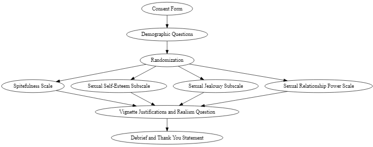
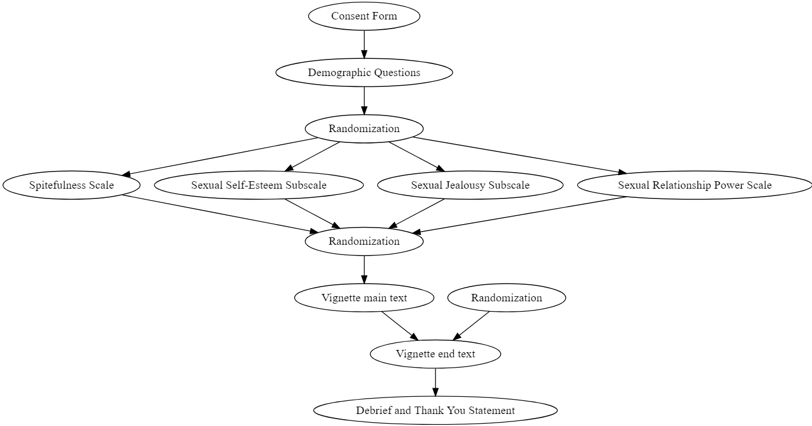

```{r setup, include=FALSE}
knitr::opts_chunk$set(
	message = FALSE,
	warning = FALSE,
	include = FALSE
)
options(htmltools.dir.version = FALSE)
df <- read.csv("C:/Users/s1932788/OneDrive/Documents/1_UoE/Research/PhD/Exploratory_Experiment_1/df.csv")
Vign.df <- read.csv("C:/Users/s1932788/OneDrive/Documents/1_UoE/Research/PhD/Exploratory_Experiment_1/Vign.df.csv")
Study1 <- read.csv("C:/Users/s1932788/OneDrive/Documents/1_UoE/Research/PhD/Exploratory_Experiment_1/Study1.csv")
participant_duration <- read.csv("C:/Users/s1932788/OneDrive/Documents/1_UoE/Research/PhD/Exploratory_Experiment_1/participant_duration.csv")
dt <- read.csv("C:/Users/s1932788/OneDrive/Documents/1_UoE/Research/PhD/Exploratory_Experiment_1/datatable1.csv")
Vign.means <- read.csv("C:/Users/s1932788/OneDrive/Documents/1_UoE/Research/PhD/Exploratory_Experiment_1/Vign.means.csv")
vignette.Means <- read.csv("C:/Users/s1932788/OneDrive/Documents/1_UoE/Research/PhD/Exploratory_Experiment_1/Vignette.Means.csv")
tab_01 <-  read.csv("C:/Users/s1932788/OneDrive/Documents/1_UoE/Research/PhD/Exploratory_Experiment_1/tab_01.csv")
tab_02 <-  read.csv("C:/Users/s1932788/OneDrive/Documents/1_UoE/Research/PhD/Exploratory_Experiment_1/tab_02.csv")
tab_04 <-  read.csv("C:/Users/s1932788/OneDrive/Documents/1_UoE/Research/PhD/Exploratory_Experiment_1/tab_04.csv")
demo_table <-  read.csv("C:/Users/s1932788/OneDrive/Documents/1_UoE/Research/PhD/Exploratory_Experiment_1/demo_table.csv")
Experiment_1 <-  read.csv("C:/Users/s1932788/OneDrive/Documents/1_UoE/Research/PhD/Exploratory_Experiment_1/Experiment_1.csv")
Experiment_1_Names <-  read.csv("C:/Users/s1932788/OneDrive/Documents/1_UoE/Research/PhD/Exploratory_Experiment_1/Experiment_1_Names.csv")
Vignettes_df <-
  read.csv(
    "C:/Users/s1932788/OneDrive/Documents/1_UoE/Research/PhD/Exploratory_Experiment_1/Vignettes.csv"
  )
gender_spite <-
  readRDS(
    "C:/Users/s1932788/OneDrive/Documents/1_UoE/Research/PhD/Exploratory_Experiment_1/Gender_Spite.RDS"
  )

Highlighted_Experiment_1 <- read.csv("C:/Users/s1932788/OneDrive/Documents/1_UoE/Research/PhD/Exploratory_Experiment_1/Highlighted_Experiment_1.csv")
model1 <- readRDS("C:/Users/s1932788/OneDrive/Documents/1_UoE/Seminar/Spring 2021/Social Psychology Seminar Presentation/model1.rds")
ttestresults <- t.test(df$Realism_Sex, df$Realism_NoSex, alternative = "two.sided", var.equal = FALSE)

vignettesNew <- read.csv("C:/Users/s1932788/OneDrive/Documents/1_UoE/Python/Experiment_2_Javascript/Experiment_2_Javascript/Experiment_2_Javascript/Vignettes/vignettesNew Jan 2020.csv") 

library(stringr)
library(ggplot2)
library(sjPlot)
library(RColorBrewer)
library(tidyr)
library(grid)  
library(gtable)  
library(DiagrammeR)
library(lubridate)
library(DT)
library(kableExtra)
library(svgPanZoom)
library(knitr)
library(ggmcmc)
library(ggridges)
library(rstan)
library(insight)
library(shiny)
library(gridExtra)
library(ggpubr)
library(gghighlight)
library(ggtext)
```

---
class: center, top


# Overview

### Literature review
### Study 1
#### Methods
#### Results
#### Bayesian Statistical Results change
### Study 2
#### Design


---
class: inverse, center, middle

# Get Started

---


.center[
# Risky Behaviors
]

- 376 million new cases of the four curable sexually transmitted infections <sup>1</sup>

  - Chlamydia
  - Gonorrhea
  - Trichomoniasis
  - Syphilis*
  
--

- Becomes problematic with antibiotic resistant bacteria such as certain strains of gonorrhea <sup>2</sup>

.footnote[1: WHO, 2016
<br>2: Costa-Lourenço et al., 2017; Ohnishi et al., 2011]


---


# Examples of risky behaviors
- Recreational
  - Skydiving
--

- Financial
  - Gambling
--

- Health/Safety
  - Risky Sexual Behavior <sup>Study 1</sup>
--

- Social
  - Strict honesty
--

- Ethical
  - Police reporting

---


# Effects of risky behaviors

- Social
  - Social/Group isolation
  - Self-objectification
  - Anti-social behaviors
--

- Financial
  - Hospital bills
  - Government cost
--

- Health
  - Negative health outcomes
  - Sexually transmitted infections
  - Pregnancy 
  - Emotional trauma


---


# Risky sexual behaviors

- I find this area of risk and decision-making very interesting. 

--

- What are the precursors?

--

- Different types of risk and the introduction of vindictive behaviors.

-- 

- j


---


# Exploratory Experiment 1

The present exploratory study sought to investigate the interaction between spiteful behavior and level of justification of spiteful acts. Endorsements of spiteful acts tends to suggest the propensity to be more spiteful. Early investigations of spiteful behavior was limited to non-sexual mundane tasks such as going to the grocery store or taking an exam in school. This exploratory study sought to expand the spitefulness literature to include sexual behaviors such as revenge sexual activity and the influence of power differentials. 

.center[

]


---


# Experiment 1: Participants

- There were a total of n = `r length(df$Gender)` participants.
  - Male: `r sum(lengths(regmatches(df$Gender, gregexpr("1", df$Gender))))`
  - Female: `r sum(lengths(regmatches(df$Gender, gregexpr("2", df$Gender))))`
  - Gender Non-Binary: `r sum(lengths(regmatches(df$Gender, gregexpr("3", df$Gender))))`

---


# Experiment 1: Measures

- Spitefulness:
  - Marcus et al., 2014
--

- Sexuality Self-Esteem Subscale:
  -  SESS; Snell & Papini, 1989
--  

- Sexual Relationship Power Scale:
  - SRPS; Pulerwitz, Gortmaker, & DeJong, 2000
--

- Sexual Jealousy Subscale:
  - SJS; Worley & Samp, 2001

---


# Experiment 1: Spitefulness

- Spitefulness: 
  - "Instances in which people harm themselves to punish
another" <sup>1</sup>

.pull-right[

]

.footnote[1: Critchfield, Levy, Clarkin, & Kernberg, 2008]

---


# Experiment 1: Spitefulness

- Clustering of participants towards the minimum along with clustering in the mid range of spitefulness scores


```{r echo=FALSE, message=FALSE, warning=FALSE, fig.width=10, fig.height=6, fig.align="center"}
ggplot(Experiment_1_Names, aes(x = Age, y = Spite, col = Gender)) +
  geom_point(position = "jitter") +
  geom_smooth(method = "lm") +
  labs(x = "Participant Age", y = "Spitefulness Score", title = "Participant Age vs Spitefulness Score ") +
  scale_y_continuous(limits = c(20, 60), breaks = seq(15, 60, 5)) + 
  scale_x_continuous(limits = c(20, 50), breaks = seq(15, 50, 5)) + 
  theme_classic(base_size = 12) + 
  theme(axis.ticks.length = unit(7, "pt"))
```

---

# Experiment 1: Vignette Example


```{r echo=FALSE, message=FALSE, warning=FALSE}
kable(Vignettes_df[1, 'Vign.8'], col.names = NULL)

```

All the vignettes have a common thread of spiteful reactions to certain behavior patterns and causes. However, some like the above, are devoid of sexual activity and are therefore a representation of the other four vignettes that are non-sexual. The above average justification score was `r sprintf(mean(Vign.df$Vign_8), fmt='%#.2f')` 
</div>
<div style = "position: fixed; bottom: 0; left: 0;">

---


# Experiment 1: Vignette Realism
.pull-left[
```{r echo=FALSE}
pt <- ggplot(Experiment_1, aes(x = Content, y = Realism, fill = Content, group = Content)) +
  stat_summary(fun = "mean", geom = "bar") + 
  stat_summary(fun.data = mean_se, geom = "errorbar") +
  expand_limits(y = c(1,5)) +
  geom_segment(y = 0, yend = 5, x = 0.4, xend = 0.4, lwd = 0.5, color = "grey30", lineend = "square") +
  geom_segment(y = -0.25, yend = -0.25, x = 1, xend = 2, 
               lwd = 0.5, color = "grey30", lineend = "square") +
  theme_classic(base_size = 12) + 
  theme(axis.line = element_blank(), 
        axis.ticks.length = unit(7, "pt")) +
  labs(title = "Mean Vignette Realism vs Content") +
  scale_x_discrete(labels = c("Non-Sexual", "Sexual")) 

pt + theme(legend.position = "none")

```
]
.pull-right[
- Statistically there was no significant difference between the average realism of either content of the vignettes, *p* = `r ttestresults$p.value`.
]

---


# Experiment 1: Results

### Vignette Justification: Violin Plot

.pull-left[
```{r echo=FALSE, message=FALSE, warning=FALSE}
ggplot(Experiment_1, aes(x = Vignettes, y = Justification, group = Vignettes, fill = Content)) + 
  geom_segment(y = 1, yend = 5, x = 0.05, xend = 0.05, lwd = 0.5, color = "grey30", lineend = "square") +
  geom_segment(y = 0.8, yend = 0.8, x = 1, xend = 10, 
               lwd = 0.5, color = "grey30", lineend = "square") +
  geom_violin(color = "black") +
  scale_x_continuous(breaks=c(1, 2,3,4,5,6,7,8,9,10), labels = c("1", "2", "3", "4", "5", "6", "7", "8", "9", "10"), name="Vignette") +
  scale_y_continuous(breaks=c(1, 2,3,4,5), labels = c("1", "2", "3", "4", "5"), name = "Level of Justification") +
  annotate("rect", xmin = 2.5, xmax = 3.5, ymin = 1, ymax = 5,
  alpha = .2) +
  theme_classic(base_size = 12) +
  theme(axis.line = element_blank(),
        axis.ticks.length = unit(7, "pt")) + 
  scale_fill_discrete(name = "Vignette /nContent", labels = c("Non-Sexual", "Sexual")) + 
  labs(title = "Vignette vs Level of Justification Color Coded by Vignette Content", caption = "Vignette 3 highlighted denoting it as an outlier")

```
]


.pull-right[
- Participants generally regarded most vignettes as not justified or having low justifiability. 
- As noted with the selection of vignette three in the left figure, most participants believed there was low justifiability with the actions. As evident by the clustering of the violin plot of vignette 3. 
]
---


# Experiment 1: Bayesian Results

.pull-left[
```{r echo=FALSE, fig.height=4, fig.width=4, message=FALSE, warning=FALSE}
tab_model(model1, show.stat = TRUE, 
          CSS = list(css.table = "font-size: 12px;"))
```
]
.pull-right[
```{r echo=FALSE, message=FALSE, warning=FALSE}
modeltesttransformed <- ggs(model1)
ggplot(filter(modeltesttransformed, Parameter %in% c("b_Intercept", "b_Spite", "b_Content")),
       aes(x   = Iteration,
           y   = value, 
           col = as.factor(Chain)))+
  geom_line() +
  geom_vline(xintercept = 1000)+
  facet_grid(Parameter ~ . ,
             scale  = 'free_y',
             switch = 'y')+
  labs(title = "Caterpillar Plots", 
       col   = "Chains") + 
  theme_classic(base_size = 12)
  
```
]

---


# Experiment 1: Summary

This first exploratory experiment sought to:

- Explore the connection of spitefulness and vindictive behavior justification. 

--
  
- Act as a foundation for future experiments and future viability. 

--

- Create a foundational step for future investigations in
  
  - Connection of power, attachment style, etc...

---


# Experiment 2: Design



---


# Vignette Change Example:

```{r}

```


---


# Tips for Experiment 2?

---


---

class: title-slide

<h1> The Psychology of Risky Sexual Decisions: Power Desires, Attachment Style, and Sexual Choices </h1>
 
<br></br>
<h2>Study 1</h2> 
<h3> Andrew Ithurburn </h3>
<h3> University of Edinburgh </h3>
<h3> `r Sys.Date()` </h3>


---